# Rawblob

**Client-side forensic file carving & reconstruction.**

Rawblob scans raw byte streams and documents for files hidden inside them —
whether embedded directly in a binary blob or encoded as Base64 inside a
text document — and reconstructs them for inspection, right in your
browser. Nothing is uploaded or stored server-side: parsing, carving,
entropy analysis, and decoding all run locally via Web Workers.

## What it does

- **Carves embedded files out of raw binary blobs.** Rather than only
  classifying what a whole file *is*, Rawblob scans every offset of a
  buffer for known file signatures, so a file concatenated or hidden inside
  another file is found and extracted independently — not just the
  outermost one.
- **Detects and decodes Base64-encoded payloads** embedded in document
  text, filtering out incidental alphanumeric noise (hashes, tokens, UUIDs)
  so you see genuine embedded files and plaintext, not everything that
  happens to be base64-shaped.
- **Scores every payload with Shannon entropy** to flag likely encryption
  or compression, with confidence tiers so small samples aren't given
  false authority.
- **Never executes or live-renders anything unsafe.** Executables are
  hex-dumped and offered only as a guarded, non-executable download.
  Markup formats (SVG/HTML) that could carry active code are rendered only
  inside a script-disabled sandboxed frame.

## Directory structure

```
rawblob/
├── app/
│   ├── layout.tsx              # Root layout, metadata, global styles
│   ├── page.tsx                # Home page — renders <Dashboard />
│   └── globals.css             # Design tokens, fonts, focus/motion rules
├── components/
│   ├── Dashboard.tsx           # Top-level composition + session state
│   ├── DropZone.tsx            # Drag-and-drop ingest, format/size validation
│   ├── TelemetryMatrix.tsx     # Real-time results table
│   ├── ReconstructionCanvas.tsx# Split-screen preview + hex inspector
│   ├── ByteRuler.tsx           # Offset ruler (full + mini position-bar)
│   └── StatusBadges.tsx        # Entropy / signature / render-mode badges
├── lib/
│   ├── workers/
│   │   ├── signatures.ts       # File signature DB (magic numbers, offsets,
│   │   │                       #   structural checks, end markers)
│   │   ├── carving.ts          # Sliding-window carving engine + entropy
│   │   ├── base64scanner.ts    # Confidence-scored Base64 payload detector
│   │   └── rawblob.worker.ts   # Worker entry point — ties it all together
│   └── hooks/
│       └── useRawblobWorker.ts # Worker lifecycle, Object URL tracking/cleanup,
│                                #   safe render-mode classification
├── test/
│   ├── harness.ts              # Engine tests (carving, entropy, base64 gating)
│   └── dom-smoke.tsx           # Component render smoke test
├── postcss.config.js       # Tailwind v4 PostCSS plugin wiring
├── tailwind.config.ts
├── tsconfig.json
├── package.json
└── README.md
```

## Quick start

**Requirements:** Node.js 18+ and npm.

```bash
# 1. Install dependencies
npm install

# 2. Run the dev server
npm run dev

# 3. Open the dashboard
# http://localhost:3000
```

To build for production:

```bash
npm run build
npm run start
```

To run the engine test suite (carving accuracy, entropy sanity, Base64
false-positive/true-positive gating):

```bash
npx esbuild test/harness.ts --bundle --platform=node --format=cjs --outfile=/tmp/harness.cjs && node /tmp/harness.cjs
```

If `next`, `framer-motion`, or React aren't already present in your
`package.json`, add them before running the dev server:

```bash
npm install next react react-dom framer-motion
```

Note on Tailwind: this project uses Tailwind CSS v4, which is configured natively in CSS (app/globals.css — @import "tailwindcss"; plus an @theme block) rather than a tailwind.config.ts file, and uses the @tailwindcss/postcss PostCSS plugin instead of the old tailwindcss plugin + autoprefixer pairing from v3. If you see a Parsing CSS source code failed / Unknown at rule: @tailwind warning, it means the classic v3-style @tailwind base/components/utilities directives are present somewhere instead of the v4 @import "tailwindcss"; syntax — check app/globals.css matches the version in this repo.

## How it works

1. **Drop or select a file** (TXT, PDF, DOCX, RTF, MD, CSV, LOG, JSON — up
   to 15MB). The size and format are validated client-side before anything
   is read.
2. The file's bytes are handed to a **Web Worker** so the UI thread never
   blocks, even on a full 15MB scan.
3. The worker runs two passes:
   - **Buffer carving** — a sliding-window scan across the entire byte
     range for known file signatures (images, archives, executables,
     audio/video containers), bounding each hit with a format-appropriate
     end marker (e.g. PNG's `IEND` chunk, PDF's `%%EOF`, ZIP's
     End-of-Central-Directory record).
   - **Text scanning** — for documents where text is extracted first
     (PDF/DOCX/etc.), a Base64 pattern scan finds encoded blocks and
     decodes candidates that clear a confidence bar: a recognized file
     signature, substantial printable text, or high-entropy binary with an
     adequate sample size.
4. Every detected payload appears as a row in the **Telemetry Matrix**,
   with its signature, entropy score, size, and a position indicator
   showing exactly where it sits in the original buffer.
5. Selecting a row opens it in the **Reconstruction Canvas**: a live
   preview (image, text, or sandboxed markup) alongside a hex dump, with a
   one-click, non-executable download.

## Usability notes

- **Everything stays local.** No network request is made with file
  content at any point — the worker never has network access, and no
  server endpoint exists to receive uploaded bytes.
- **Weak signatures are labeled, not hidden.** Short or easily-collided
  magic numbers (e.g. `MZ` for PE, `BM` for BMP) are shown with a "weak
  sig" tag rather than presented with the same confidence as a strongly
  matched format, so you know when a hit deserves a second look.
- **Entropy is contextualized, not just reported.** Low-sample readings
  are marked `low-n` rather than presented with false precision, and a
  payload whose entropy doesn't match what's expected for its claimed type
  is flagged `inconsistent` — itself a useful forensic signal.
- **Executable content is inert by design.** PE and ELF payloads are never
  rendered or given a live preview URL; they can only be hex-inspected or
  downloaded as a generic `.bin` file, which won't auto-execute on save.
- **Markup is sandboxed.** SVG and HTML-shaped payloads render inside an
  `<iframe sandbox="">` with scripting disabled, since these formats can
  carry executable content of their own.
- **Keyboard accessible throughout.** The drop zone and every Telemetry
  Matrix row are focusable and operable via keyboard (Enter/Space), with a
  visible focus ring.
- **Reduced motion respected.** Users with `prefers-reduced-motion` set get
  instant state changes instead of the drop-zone and scan animations.

## Design system

- **Palette:** dark graphite base with three semantic accents — amber
  (active/primary), teal (verified/consistent), red (high-entropy/danger)
  — used functionally for forensic triage rather than decoratively.
- **Type:** IBM Plex Sans for UI chrome, IBM Plex Mono for offsets, hex,
  and all byte-level data — a family designed for technical readouts.
- **Signature element:** the **byte ruler** — a tick-marked offset strip
  shown above the Reconstruction Canvas and as a compact position-bar per
  Telemetry Matrix row, so the buffer position of every payload is always
  visible, not buried in a table column.

## Known limitations / not yet wired

- PDF (`pdfjs-dist`) and DOCX (`mammoth.js`) text extraction are not yet
  connected to `analyzeText` — the worker currently accepts raw text or a
  raw buffer directly; hooking up per-format extraction is the next step
  before non-plaintext document types can be scanned end-to-end.
- SVG signature detection is defined in `signatures.ts` but not yet
  actively matched (SVG has no fixed magic number and needs a lightweight
  XML-prolog sniff) — the `sandboxed` render path is ready for it.
- Very large extracted text blobs are scanned in a single synchronous pass
  inside the worker; fine at the current 15MB ceiling, but worth chunking
  with a match cap if that ceiling is ever raised.
